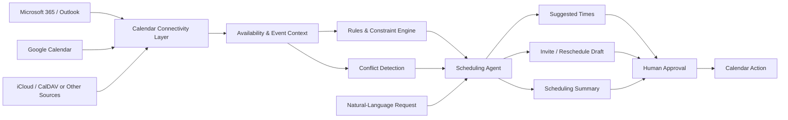
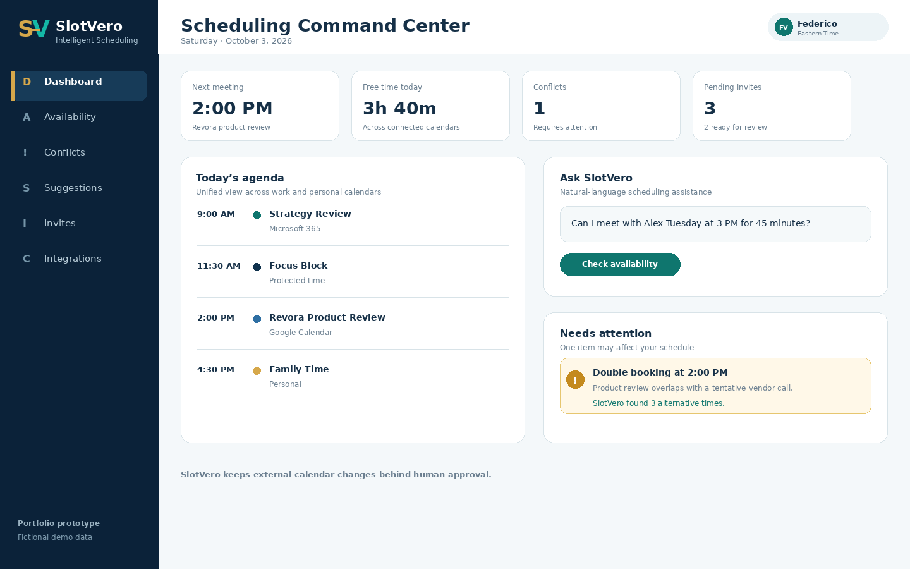
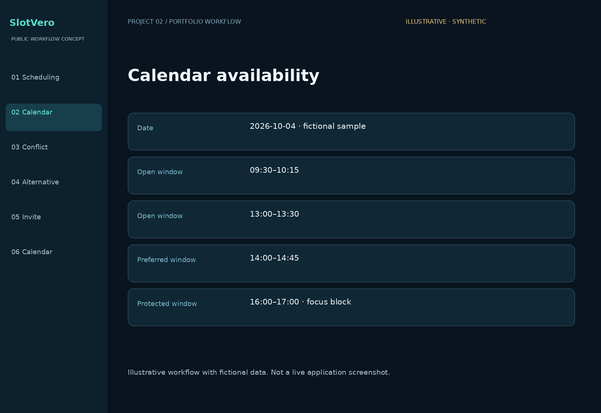
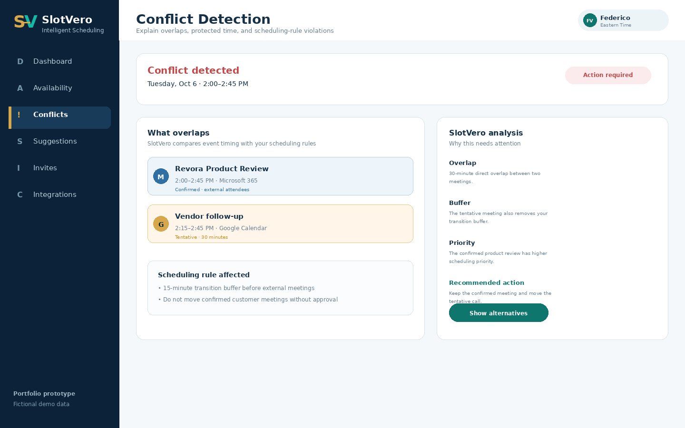
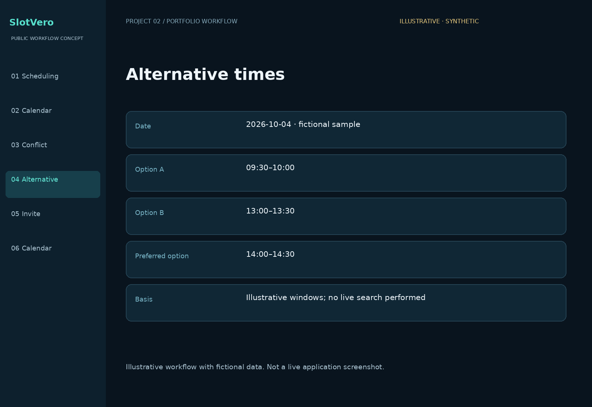
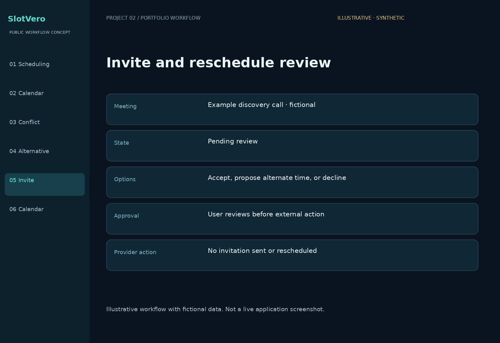
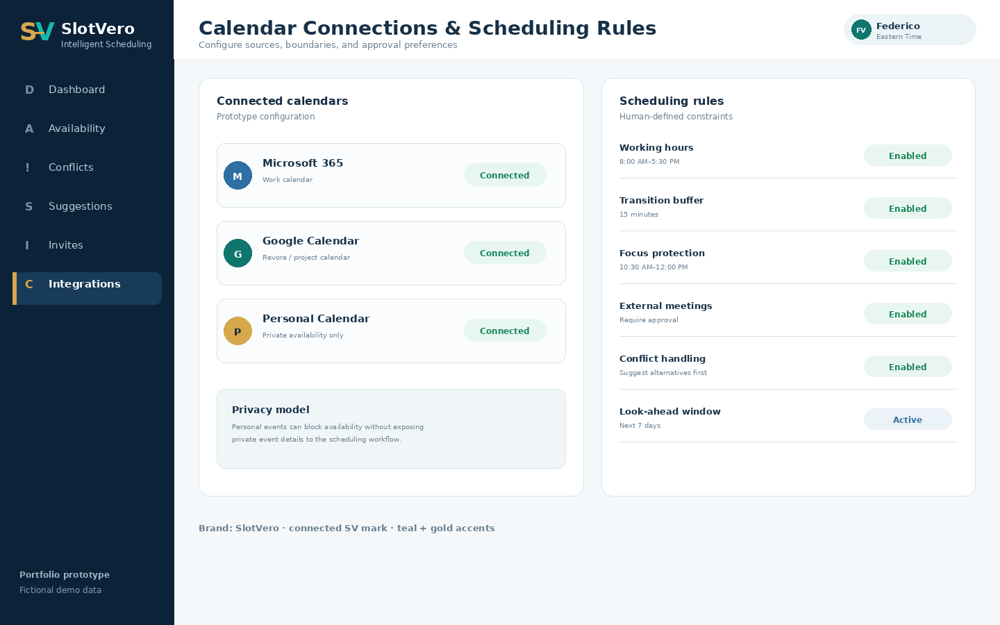

# Intelligent Scheduling Assistant (Vesper)

> Public portfolio case study of an AI-assisted scheduling agent designed to reduce calendar friction, detect conflicts, and support better meeting coordination across multiple calendars.

---

## Overview

This repository is a **sanitized public portfolio case study** for an intelligent scheduling assistant. The prototype interface is shown under the working product name **Vesper**.

The concept is designed around a simple operating problem: calendars are easy to fill, but difficult to coordinate well. Meetings often require repeated availability checks, conflict resolution, back-and-forth messages, and manual rescheduling across work and personal calendars.

This project explores how an AI-assisted scheduling layer can help a user understand availability, detect conflicts, suggest better options, and prepare scheduling actions while keeping the user in control of final calendar changes.

**Core implementation, credentials, private workflows, and production integrations are maintained privately.**

> **Portfolio note:** All screenshots use fictional demo data. The public materials demonstrate product direction, workflow design, and prototype UX; they do not claim production deployment or live connector readiness.

---

## The Problem

Scheduling becomes difficult when a person works across multiple calendars, priorities, meeting rules, and time constraints.

Common friction includes:

- Checking several calendars before accepting a meeting
- Discovering conflicts after an invitation arrives
- Repeated back-and-forth to find a workable time
- Losing protected focus time to new meetings
- Moving meetings without understanding downstream effects
- Managing different rules for internal and external meetings
- Coordinating work, personal, and family commitments
- Spending executive time on calendar administration instead of higher-value work

---

## The Concept

The Intelligent Scheduling Assistant acts as a coordination layer between calendar sources, scheduling rules, user intent, and meeting actions.

### Selected capabilities

| Capability | Public portfolio description |
|---|---|
| Scheduling Command Center | One view for agenda, availability, conflicts, and scheduling issues |
| Cross-Calendar Availability | Review free and busy windows across connected calendar sources |
| Conflict Detection | Identify overlapping meetings, protected time, and rule violations |
| Alternative Time Suggestions | Suggest practical meeting windows based on constraints and preferences |
| Invite & Reschedule Support | Prepare meeting responses, rescheduling options, and next actions |
| Scheduling Rules | Apply working hours, buffers, focus protection, and approval preferences |
| Natural-Language Requests | Let the user ask scheduling questions in normal business language |
| Human-in-the-Loop Control | Keep final calendar changes subject to user approval |

---

## How AI Fits In

The design goal is not to automate every calendar decision. It is to reduce unnecessary coordination work while preserving human judgment.

Public examples include:

- Interpreting natural-language scheduling requests
- Comparing availability across calendar sources
- Identifying conflicts and constraint violations
- Ranking practical alternatives
- Summarizing why a proposed time works or does not work
- Preparing invite, decline, or reschedule options
- Protecting focus time according to user-defined rules
- Helping the user look ahead across a defined scheduling window

Detailed prompts, orchestration, provider-specific logic, approval rules, authentication flows, and automation logic are intentionally not published here.

---

## High-Level System View

This diagram is intentionally high level and does not disclose implementation-specific architecture or provider credentials.

---

## Product Screenshots

### 1. Scheduling Command Center
A single management view for today's agenda, open focus time, pending scheduling issues, and natural-language scheduling requests.

---

### 2. Cross-Calendar Availability
A consolidated availability view designed to make it easier to understand open windows across multiple calendars and scheduling constraints.

---

### 3. Conflict Detection
A workflow for identifying overlapping commitments, protected time, and scheduling rules that may require attention before accepting or moving a meeting.

---

### 4. Alternative Time Suggestions
A decision-support view that presents practical alternatives instead of simply reporting that a requested meeting time is unavailable.

---

### 5. Invite & Reschedule Workflow
A review step for meeting invitations and rescheduling actions, designed to keep the user in control before external calendar changes are made.

---

### 6. Calendar Connections & Scheduling Rules
A prototype configuration view for calendar sources, working hours, transition buffers, focus protection, external meeting approvals, and conflict-handling preferences.

> All people, meetings, calendar states, and scheduling data shown in these screenshots are fictional and sanitized for portfolio use.

 

## Business Value

The concept is designed around measurable productivity and coordination outcomes:

- Reduce time spent checking calendars manually
- Shorten meeting-scheduling back-and-forth
- Identify conflicts earlier
- Protect focus time more consistently
- Improve executive and team coordination
- Reduce avoidable double-booking
- Make rescheduling decisions with more context
- Apply scheduling preferences consistently
- Keep humans in control of consequential calendar actions

---

## Design Principles

### Reduce friction, not control
The agent should help remove administrative work without taking ownership away from the user.

### Explain the recommendation
A useful scheduling assistant should show why a suggested time works, not only provide an answer.

### Respect boundaries
Working hours, protected time, personal calendars, buffers, and approval requirements should be treated as operating constraints.

### Human approval for external actions
The prototype is designed around review and approval before important invite, decline, cancel, or reschedule actions are finalized.

### Connect systems around the user
The goal is one coordination layer across calendars rather than forcing the user to manage every source separately.

---

## Public vs. Private

### Publicly shown here

- Business problem
- Product direction
- High-level capabilities
- Prototype user experience
- High-level system view
- Sanitized screenshots
- Fictional sample data
- Business value and product thinking

### Maintained privately

- Source code
- OAuth credentials and tokens
- API keys and secrets
- Provider-specific authentication logic
- Detailed architecture
- AI prompts and agent instructions
- Tool-calling logic
- Scheduling decision rules
- Automation and approval logic
- Production calendar data
- Customer-specific integrations
- Proprietary workflows and commercial roadmap

---

## Project Status

**Prototype / public portfolio overview**

This public repository exists to demonstrate applied AI product thinking, workflow design, scheduling-agent concepts, and human-centered automation while protecting the underlying implementation.

The screenshots are polished prototype/demo screens using fictional information. Individual connector and automation capabilities should be considered **demonstrated product direction unless separately verified in a working environment**.

---

## About the Builder

**Federico Veneziano**

Executive operator and applied AI builder with 30+ years across manufacturing, operations, finance, technology, and business transformation.

- Leadership responsibility across 400+ employees
- Executive operations and financial leadership
- Manufacturing technology and systems experience
- Workflow automation and applied AI
- Agentic workflow development
- Voice and scheduling agent concepts
- DeepLearning.AI Agentic AI certificate
- AWS Certified AI Practitioner — in progress

---

## Contact

**Email:** fveneziano0503@outlook.com  
**GitHub:** [Fveneziano0503](https://github.com/Fveneziano0503)
